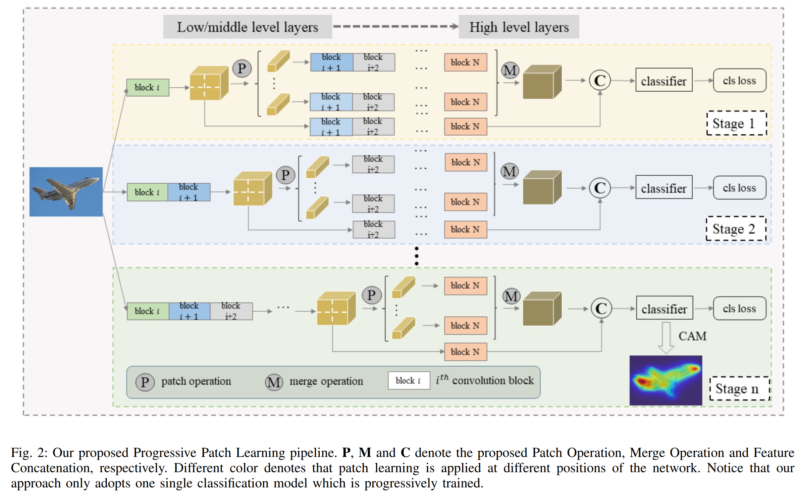
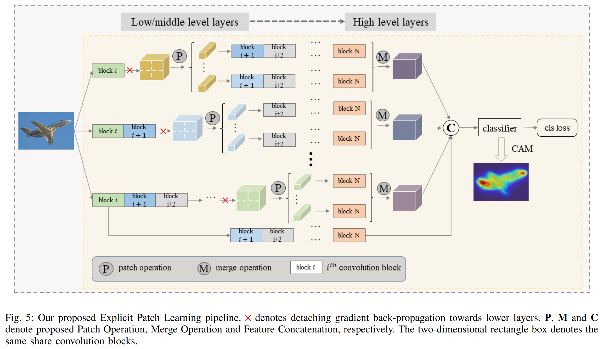

# Offical code of our paper "Weakly Supervised Semantic Segmentation via Progressive Patch Learning" (TMM 2022).

## Abstract

Most of the existing semantic segmentation approaches with image-level class labels as supervision, highly rely on the initial class activation map (CAM) generated from the standard classification network. In this paper, a novel “Progressive Patch Learning” approach is proposed to improve the local details extraction of the classification, producing the CAM better covering the whole object rather than only the most discriminative regions as in CAMs obtained in conventional classification models. “Patch Learning” destructs the feature maps into patches and independently processes each local patch in parallel before the final aggregation. Such a mechanism enforces the network to find weak information from the scattered discriminative local parts, achieving enhanced local details sensitivity. “Progressive Patch Learning” further extends the feature destruction and patch learning to multi-level granularities in a progressive manner. Cooperating with a multi-stage optimization strategy, such a “Progressive Patch Learning” mechanism implicitly provides the model with the feature extraction ability across different localitygranularities. As an alternative to the implicit multi-granularity progressive fusion approach, we additionally propose an explicit method to simultaneously fuse features from different granularities in a single model, further enhancing the CAM quality on the full object coverage. Our proposed method achieves outstanding performance on the PASCAL VOC 2012 dataset (e.g., with 69.6%
mIoU on the test set), which surpasses most existing weakly supervised semantic segmentation methods. 

The implementation of our paper "Weakly Supervised Semantic Segmentation via Progressive Patch Learning" (PPL), Jinlong Li, Zequn Jie, Xu Wang, Yu Zhou, Xiaolin Wei, Lin Ma.

Code will be made publicly available soon.
